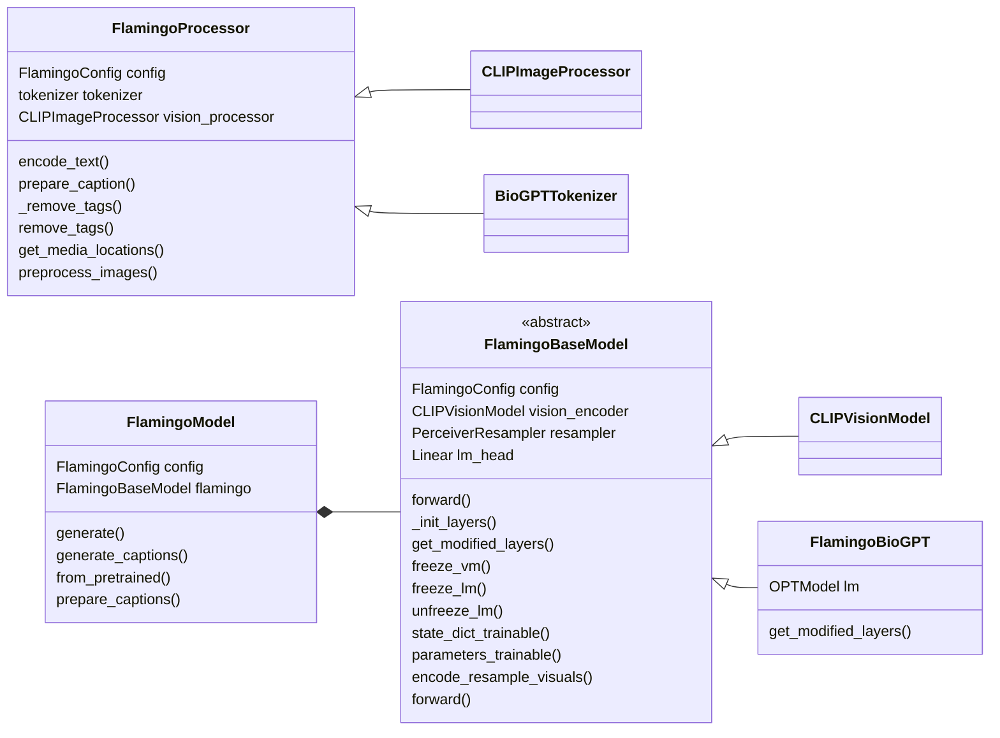

# Flamingo mini

Medical fields implementation of the deepmind  Flamingo vision-language model. The code is based on Lucidrains implementation of the perceiver resampler and the gated cross-attention layers, and utilizes pretrained vision and language models from Huggingface.

At the moment I am running and testing codes on the MIMIC data.

(!) Note that this repo is work in progress and may be subject to breaking changes.

- [x] Add the medical vision and lm models
- [ ] Report the detailed result
- [ ] Move on other vision and LM models 
- [ ] Model online


## Install

(requires python 3.7)

```bash
git clone https://github.com/dhansmair/flamingo-mini.git
cd flamingo-mini
pip install .
```

### Parameters

You can specify the architecture by passing the following parameters to FlamingoConfig() on `flamingo_mini/flamingo_processor.py`:

```python
lm: str = ''                        # select language model. Possible values: BioMedGPT
clip_model_type: str = ''           # vision encoder. Possible other: BioMedCLIP visual encoder
dim: int =                          # length of a language token, depends on used language model which is just the n_positions
dim_visual: int =                   # length of a visual feature, depends on the vision encoder
xattn_every: int = 1                # frequency of interleaved xattn layers
xattn_dim_head: int = 64
xattn_heads: int = 8
xattn_ff_mult: int = 4
xattn_act: str = 'gelu'             # activation function in the xattn FFW blocks. Possible values: gelu, sqrelu, relu

resampler_depth: int = 6            # number of layers of the perceiver resampler
resampler_dim_head: int = 64
resampler_heads: int = 8
resampler_num_latents: int = 64     # number of queries
resampler_num_time_embeds: int = 4
resampler_ff_mult: int = 4
resampler_act: str = 'gelu'         # activation function in the resampler FFW blocks. Possible values: gelu, sqrelu, relu
freeze_language_model: bool = True
freeze_vision_model: bool = True

```

## Training

A core idea of Flamingo is to reuse off-the-shelf language model and vision encoder. As such, their weights are frozen during flamingo training, and only the perceiver resampler and the gated cross-attention layers are updated.
We can do that by setting the parameters `freeze_language_model` and `freeze_vision_model`, which are True by default (There is also methods `model.freeze_lm()` and `model.freeze_vm()`). Note that, the embedding layers in the LM are also frozen.

### Using a different language model

The FlamingoModel is implemented in such a way that no modification of the underlying language model's source code is necessary, so it should be relatively easy to extend the code to other models. However, some steps are required: 

1. BioMedCLIP visual encoder should give a good starting point. To inject the gated cross-attention layers, replace layers in the lm with wrappers using the `_init_layers()` method.
Every language model comes with a specific tokenizer, so make sure to adapt FlamingoProcessor to use the correct tokenizer.

### Using a different vision encoder

By default, the model uses the visual encoder in the BioMedCLIP. A different encoder size can be set with the `clip_model_type` parameter.
If you want to use a completely different encoder, e.g. ResNet, you will need to adjust FlamingoProcessor and replace the `vision_processor` property.
You will also need to replace the `vision_encoder` property of FlamingoBaseModel and override the method `encode_resample_visuals()`.

A high level overview of this repository:



## Functions in FlamingoProcessor

### `__init__(self, config: FlamingoConfig,)`: 

1. Receive the flamingo configure and declare the `self.tokenizer`
2. Declare the `self.vision_processor` which is used to process the input images

### `__call__(self, config: FlamingoConfig,)`: 

1. Process  images by the `self.vision_processor` and save the processed values in the `result['pixel_values']`
2. Process the text by the `self.encode_text()` and save the processed values in the `result['input_ids'] = input_ids`, `result['media_locations']`, `result['attention_mask']` 

### `encode_text(self,text: str | List[str], device: torch.device | None = None, max_length=None, length=None, return_tensors='pt' return_attention_mask=True)`: 

1. Tokenize the input raw text
2. Find the `<image>` location by the `get_media_locations()`

### `prepare_caption`:

1. Modify the format of the caption

### `remove_tags(self, text)`:

1. Delete the original tags

### `preprocess_images(self, images)`:

1. Input the images to the `self.vision_processor`

## Functions in FlamingoBaseModel

### `__init__(self, config: FlamingoConfig, suppress_warnings=True)`

1. Declare the `self.vision_encoder`, `self.resampler`, 

### `_init_layers(self, lm_layers: nn.ModuleList)`:

1. Modify those layers in the lm, adding the xattention layer

### `encode_resample_visuals(self, pixel_values: torch.Tensor)`

1. reshape the size of input images for different situations and pass pixel values through vision encoder
2. pass the features to the `self.resampler`

### `forward(self, input_ids: torch.Tensor | None = None, attention_mask: torch.Tensor | None = None, media_locations: torch.Tensor | None = None, pixel_values: torch.Tensor | None = None,visual_features: torch.Tensor | None = None,head_mask: torch.Tensor | None = None,inputs_embeds: torch.Tensor | None = None,use_cache: bool = False,past_key_values: tuple | None = None,return_dict: bool = True,labels: torch.Tensor | None = None,loss_reduction: str = 'mean',**kwargs)`:

1. Pass the visual features and lm features along layers in the lm layers

## Functions in FlamingoBModel

### ` __init__(self, config: FlamingoConfig, model_class: type | None = None)`:

1. Declare `self.flamingo` by instantiating the `FlamingoBaseModel`

### `prepare_inputs_for_generation(self,input_ids: torch.Tensor,media_locations: torch.Tensor | None = None,attention_mask: torch.Tensor | None = None,pixel_values: torch.Tensor | None = None,visual_features: torch.Tensor | None = None,past=None,past_key_values=None,**kwargs)`:


### `generate_captions(self,processor: FlamingoProcessor,pixel_values: torch.Tensor | None = None,images: Image.Image | List[Image.Image] | None = None,prompt: str = "<image>",max_length: int = 150,num_beams: int = 1,device: torch.device | None = None,**kwargs)`:

1. Give the prompt: `<image>`
2. Acquqire the captions
3. Details can be found in `transformers.gengeration.utils.GenerateMixin`

## Chex Dataset

1. `self.dataset = {'images':{},'annotations':{}}`
2. `self.anns = dict()`
3. `self.imgs = dict({'file':[], 'annotation_id':int, 'id':int})`